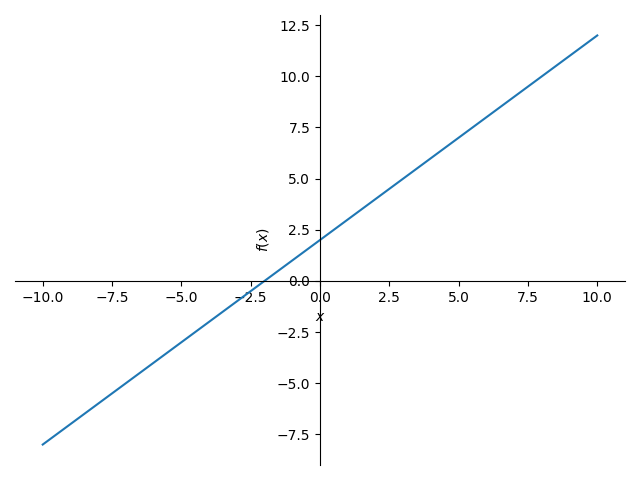
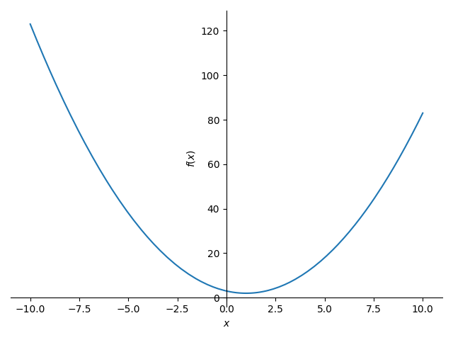
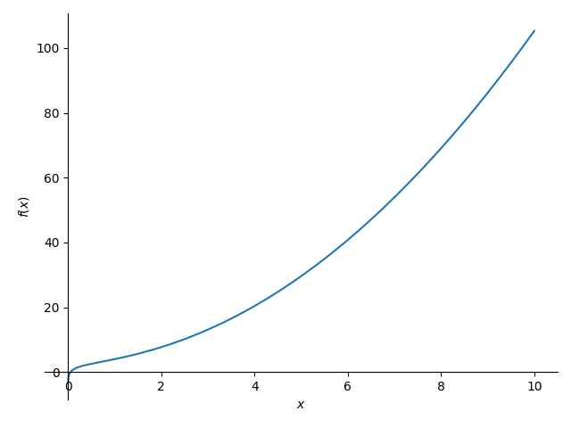

# 그래프 자동 그리기

#### ***그래프 시각화 프로그램***

</br>

##### 이름:이유찬 | 학교:경인고등학교 | 2학년

---

# ✨ Project Information

### | **준비 기간**

  </br>

###### 1개월

</br>

### | **관련 교과**

  </br>

###### `Computer Science`, `Math`, `시각화`

---

# 📝 프로젝트 내용

### | 탐구 동기

학교에서 이번학기에 지수함수, 로그함수 등 다양한 형태의 식에 대한 함수에 대해 학습했다. 학습 과정에서 배운 함수의 형태를 그려보는 것에 어려움이 있었는데 이것을 그동안 배운 정보 지식을 활용해서 그래프를 그려보면 학습에 도움이 될 것 같아서 프로젝트를 시작하게 되었다.
<br/>
이에 파이썬를 사용해서 그래프 시각화 프로그램을 제작하고자 한다

---

# 📝 프로젝트 내용

### | 교과 연관성

수학의 일차함수,이차함수,지수함수,로그함수 등 여러 함수들의 형태를 알 수 있고 이를 통해 수학의 여러 함수들을 더욱 익숙하고 쉽게 받아들일 수 있다.
<br/>

---

# 📝 프로젝트 내용

### | 활동 내용

프로그래밍 언어인 파이썬을 사용하여 그래프 시각화 프로그램을 제작함

---

## 💡 code

- #### 도움말 및 제작자

```python
print("----------그래프 자동 그리기----------")

some = input("도움말\n1)사용법\n2)제작자:")
if some == "1)" or "1":
  print("이차함수 및 일차함수: ex)x^2+2*x-3 \n 지수함수: ex)x^2 + exp(x) \n 로그함수: x^2 + log(x)")
elif some == "2)" or "2" :
  print("이유찬")
``` 

---

## 💡 code

- #### 그래프 시각화 프로그램

```python
#%%
reqast = input("그리실 함수 식을 입력하세요: ")
reqast = reqast.replace("^","**")

from sympy import *
import sympy as sy
import numpy as np
import matplotlib.pyplot as plt
```

---

## 💡 code

```py
x = sy.symbols('x')
fx = parse_expr(reqast)
plot(fx)
x_vals = np.linspace(-100, 100, 1000)
y_vals = [fx.subs(x, val) for val in x_vals]
```

---

## 💡 code

- #### 그래프 시각화 및 x값,y값 제한 프로그램

```python
# %%
plt.plot(x_vals, y_vals)
plt.xlim(-100, 100)
plt.ylim(-100, 100)
plt.xlabel('x')
plt.ylabel('y')
plt.title('Graph of f(x)')
plt.grid(True)
plt.show()
#%%

```


---

## 💡 code

- #### read data

```python
x+2
```


## ✅ result



---
## 💡 code

- #### read data

```python
x^2 - 2 * x + 3
```


## ✅ result



---
## 💡 code

- #### read data

```python
x^2 + 3 + log(x)
```


## ✅ result

